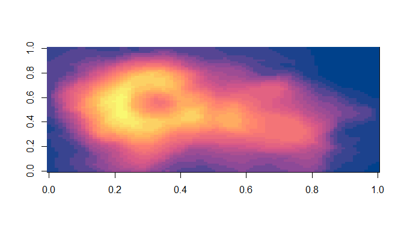
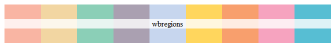
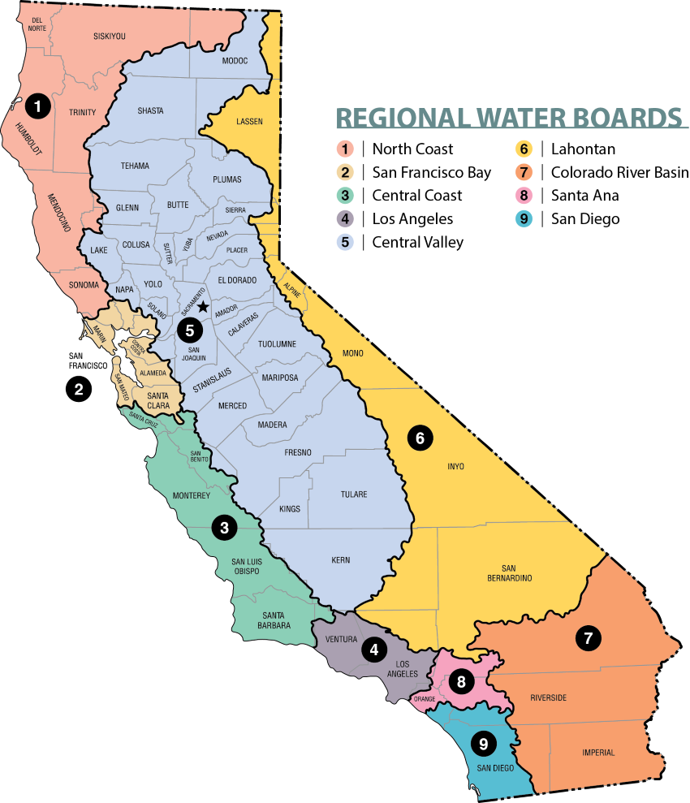
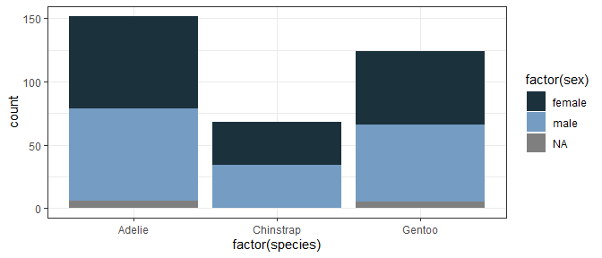

README
================

<!-- README.md is generated from README.qmd. Please edit that file -->

# waterpal: palettes for the California Water Boards

These are color palettes based on art and iconography from the
California State Water Resources Control Board, USA. Code from
[Karthik](http://www.github.com/karthik)’s wesanderson package. Palettes
were generated using mycolorpicker and mycolor.image.

**Contributions**: I welcome contributions to this package. Some
potential contributions could include: additional palettes, edits to
current palettes, additional examples of potential use, or examples
where the palettes have been used in presentations or publications. For
the GitHub-savvy, send a pull request with your edits. If you want to
contribute but are unsure how, send me an email (or Teams message if
within the Water Boards) and we can make it happen.

## Installation

``` r
devtools::install_github("cclatterbuck/waterpal")
#> Skipping install of 'waterpal' from a github remote, the SHA1 (227bb991) has not changed since last install.
#>   Use `force = TRUE` to force installation
```

## Palette names

``` r
library(waterpal)
# See all palettes
names(water_palettes)
#> [1] "bardo"        "cwqmc"        "cwqmcdark"    "tribalbanner" "tribalheader"
#> [6] "wbregions"    "datasalmon"   "logogradient" "drought"
```

## View & use palettes

### Water Boards blues

``` r
water_pal("logogradient") ## first color is the blue of the WB logo
```


``` r
water_pal("bardo")
```


``` r
water_pal("cwqmc")
```


``` r
water_pal("cwqmcdark")
```


``` r
pal <- water_pal("logogradient", 25, type = "continuous")
image(volcano, col = pal)
```



### Regions

``` r
water_pal("wbregions")
```





> Can be used in conjunction with this regional map!

### Tribal affairs

``` r
water_pal("tribalbanner")
```


``` r
water_pal("tribalheader")
```


### Water data challenge

``` r
water_pal("datasalmon")
```


``` r
library("ggplot2")
library("palmerpenguins")
ggplot(penguins, aes(factor(species), fill=factor(sex))) +  geom_bar() +
  scale_fill_manual(values = water_pal("datasalmon")) +
  theme_bw()
```



### Drought

Colors from the [US Drought
Monitor](https://droughtmonitor.unl.edu/About/AbouttheData/DroughtClassification.aspx)
classifications

``` r
water_pal("drought") 
```


